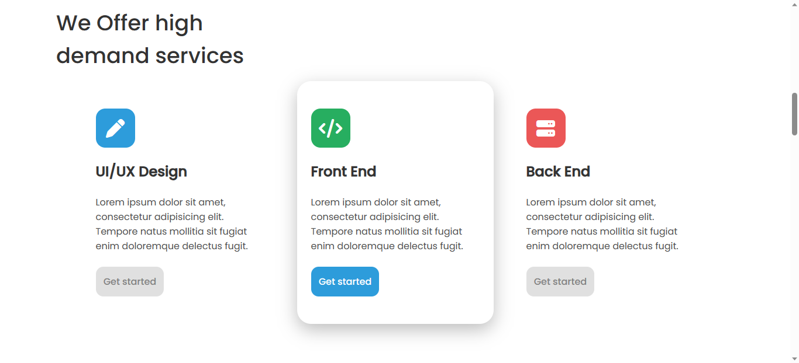

<h1 align="center">Edie Homepage</h1>

   Solution for a challenge from  <a href="http://devchallenges.io" target="_blank">Devchallenges.io</a>.

  <h3>
    <a href="https://flakobb.github.io/edie-homepage/">
      Demo
    </a>
     | 
    <a href="https://github.com/FlakoBB/edie-homepage">
      Solution
    </a>
     | 
    <a href="https://devchallenges.io/challenges/xobQBuf8zWWmiYMIAZe0">
      Challenge
    </a>
  </h3>

<!-- TABLE OF CONTENTS -->

## Table of Contents

- [Overview](#overview)
  - [Built With](#built-with)
- [Features](#features)
- [Contact](#contact)

<!-- OVERVIEW -->

## Overview

Homepage structured in **HTML** and styled with **CSS** using _Flex_ and _Grid_

### Built With

- HTML
- CSS
  - Flex
  - Grid

## Features

This application/site was created as a submission to a [DevChallenges](https://devchallenges.io/challenges) challenge. The [challenge](https://devchallenges.io/challenges/xobQBuf8zWWmiYMIAZe0) was to build an application to complete the given user stories.

## Contact

- Redes [Follow me](https://bit.ly/follow-flako)
